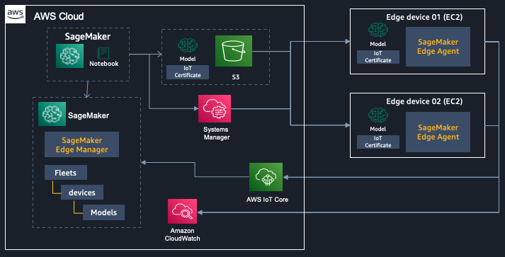

# Sagemaker-edge-manager-getting-started

이 리파지토리는 Amazon SageMaker Edge Manager 의 아래 원본을 기본으로 합니다.

원본 노트북: Amazon SageMaker Edge Manager
- https://github.com/aws/amazon-sagemaker-examples/tree/master/sagemaker_edge_manager

## SageMaker Edge Manager 특징

+ 엣지 장치 하드웨어용 맞춤형 모델 준비합니다
+ 엣지 장치에서 기계 학습 추론을 효율적으로 실행하기 위한 런타임을 포함합니다.
+ 엣지 장치에서 각 모델의 데이터 샘플을 안전하게 SageMaker로 전송하여 라벨 재지정 및 재훈련을 수행할 수 있습니다.

이 서비스에는 두 가지 주요 구성 요소가 있습니다.
+ 클라우드에서의 세이지메이커 엣지 매니저 
+ 엣지 장치의 세이지메이커 엣지 에이전트

이 전체 Nootebook은 에지 장치에서 실행중인 Sagemaker Edge를 가져 오는 엔드 투 엔드 워크플로를 보여줍니다.여기에는 다음 단계가 포함됩니다.

+ 세이지메이커 네오를 사용하여 모델을 컴파일
+ 세이지메이커 에지 관리자로 컴파일 된 모델 패키지
+ 세이지메이커 에지 관리자 에이전트를 사용하여 배포
+ 모델과 함께 추론 실행
+ 모델의 입력 및 출력 데이터를 S3로 캡처
+ 엣지에서의 실형 결과를 CloudWatch로 전송
+ 엣지 추가의 예제 (역자가 기존 샘플에 없는 것을 추가 함)

## 코드 완료 후 구성도

## 노트북 상세 설명
이 원본을 아래와 같이 3개로 분리하고, 마지막 1개는 새로이 추가 했습니다.

#### 1.1.Demo-Setup.ipynb
- SageMaker 노트북을 실행하고 있는 Role의 정책 추가
- 엣지 디바이스로서 EC2를 생성 합니다

#### 2.1.Prepare-DeviceFleet.ipynb
- 엣지 디바이스에 수행할 ML 모델(mobile-net)을 준비 (Neo 컴파일 및 패키징)
- AWS IoT Thing 생성
    - 엣지 디바이스 --> AWS IoT thing 인증 수행 --> SageMaker 엣지 매니저 엔드포인트 호출
- Device Fleet 생성    
- 엣지 디바이스 device fleet에 등록
- AWS IoT Thing 에 Client Certificate을 생성 및 등록
    
#### 3.1.Setup-EdgeDevice.ipynb
- sagemaker edge manager agent를 EC2 인스턴스에 다운로드
- 릴리스 버킷에서 모델 서명 루트 인증서를 다운로드
- 모델 패키징 파일 다운로드 및 추론할 샘플 이미지 다운로드
- sagemaker edge agent configuration file 생성, S3 업로드 및 EC2에 다운로드
- Launch Edge Agent 실행
- 모델 로딩
- 모델 추론
- 모델 추론 및 결과 캡쳐
- CloudWatch 연결

#### 4.1.Add-EdgeDevice.ipynb
- EC2 인스턴스 생성
- Device Fleet에 엣지 디바이스 등록
- sagemaker edge manager agent를 EC2 인스턴스에 다운로드
- 릴리스 버킷에서 모델 서명 루트 인증서를 다운로드
- 모델 패키징 파일 다운로드 및 추론할 샘플 이미지 다운로드
- sagemaker edge agent configuration file 생성, S3 업로드 및 EC2에 다운로드
- Launch Edge Agent 실행
- 모델 로딩
- 모델 추론

